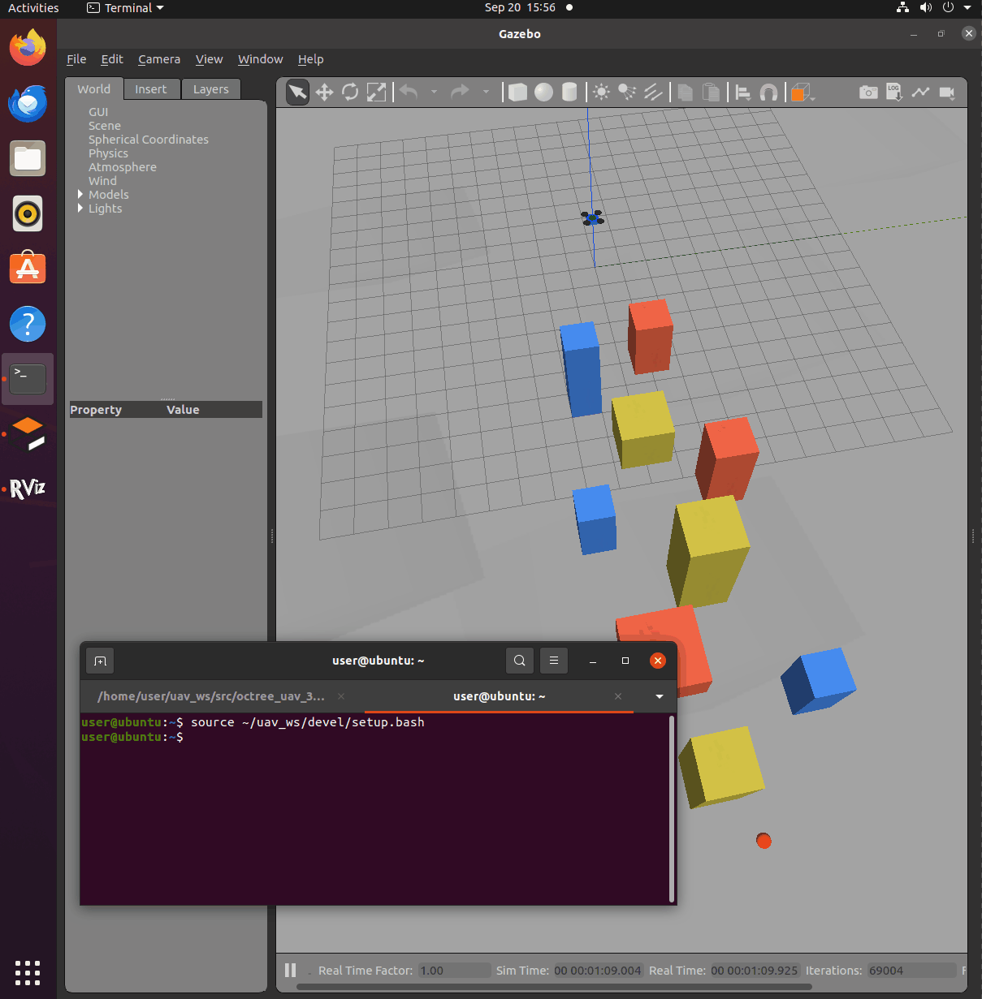

# 四旋翼与位置控制

本文介绍空域载具八叉树三维寻路项目中的飞行器模型与位置控制器：把四旋翼抽象为
"受控质点"，通过外力实现稳定悬停与受控飞行，为后续的点云建图与三维寻路提供
可控的移动平台。

---

## 1. 质点四旋翼模型

模型定义在 `src/air/octree_uav_3d_pathfinding/models/quadrotor.sdf`。

| 项目 | 参数 |
|---|---|
| 机体尺寸 | 0.42 x 0.42 x 0.12 m |
| 质量 | 1.0 kg |
| 转动惯量 | Ixx = Iyy = 0.005，Izz = 0.009 kg·m² |
| 旋翼 | 4 个（半径 0.13 m，仅作视觉表示） |
| 传感器 | 3D 激光雷达（水平 360 度、垂直 8 线、量程 20 m） |

**为什么抽象成"受控质点"**：本项目重点是三维寻路算法，而不是飞行器气动力学。
把机体作为受外力控制的质点，既能体现重力、惯性等基本动力学特性（不是无视物理的
"幽灵飞行"），又不需要引入电机、桨叶等复杂模型，便于把精力集中在寻路本身。

模型带有三个 Gazebo 插件：

| 插件 | 作用 |
|---|---|
| `libgazebo_ros_p3d.so` | 发布里程计 `/ground_truth/odom` 与 TF（world → base_link） |
| `libgazebo_ros_force.so` | 订阅 `/quadrotor/wrench`，对机体施加外力 |
| `libgazebo_ros_block_laser.so` | 3D 激光雷达，点云发布到 `/cloud_in` |

其中 `p3d` 插件提供的位姿与 TF 有两个用途：一是给位置控制器做反馈，
二是后续把激光点云从机体坐标系变换到世界坐标系，用于构建八叉树地图。

---

## 2. 位置控制器

控制器实现见 `src/air/octree_uav_3d_pathfinding/scripts/uav_controller.py`。

把飞行器视为质量为 m 的质点，控制律为：

    F = m * ( Kp * (p_des - p) + Kd * (v_des - v) + g_vec )

其中：

* `p_des`、`v_des` 为期望位置与期望速度，`p`、`v` 为当前位姿与速度
* `g_vec = (0, 0, g)` 用于抵消重力，使飞行器能够悬停
* `Kp` 决定回位速度，`Kd` 提供阻尼以抑制振荡（取 2·√Kp 附近接近临界阻尼）

控制器订阅 `/ground_truth/odom` 获取位姿与速度，以 50 Hz 计算并发布外力到
`/quadrotor/wrench`，同时把运行状态发布到 `/uav/status`。

主要参数（位于 `config/params.yaml`）：

| 参数 | 默认值 | 说明 |
|---|---|---|
| mass | 1.0 | 机体质量（kg），需与模型一致 |
| kp | 4.0 | 位置环比例增益 |
| kd | 4.0 | 速度环阻尼增益 |
| gravity | 9.81 | 重力加速度，用于重力补偿 |
| max_force | 40.0 | 外力限幅（N），防止控制量过大导致仿真发散 |
| control_rate | 50.0 | 控制频率（Hz） |
| goal_x / goal_y / goal_z | 0 / 0 / 2.0 | 初始目标点（默认与起飞位置相同，表现为悬停） |

---

## 3. 运行方法

```shell
# 载入工作空间环境
source ~/uav_ws/devel/setup.bash

# 启动仿真世界、四旋翼飞行器与位置控制器
roslaunch octree_uav_3d_pathfinding main.launch
```

启动后飞行器在起点稳定悬停。在另一个终端下发目标点，飞行器便会受控飞向该点：

```shell
# 需要一个新的终端
source ~/uav_ws/devel/setup.bash
rostopic pub -1 /uav/goal geometry_msgs/Point "{x: 8.0, y: 2.0, z: 3.0}"
```

---

## 4. 运行效果

启动后飞行器稳定悬停在 2 m 高度，终端输出的高度误差约 2 mm：


下发目标点后，飞行器受控飞向目标点：



到达目标点后稳定停住：


---

## 5. 主要话题

| 话题 | 类型 | 方向 | 说明 |
|---|---|---|---|
| /cloud_in | sensor_msgs/PointCloud | 发布 | 3D 激光雷达点云 |
| /ground_truth/odom | nav_msgs/Odometry | 发布 | 飞行器位姿与速度 |
| /quadrotor/wrench | geometry_msgs/Wrench | 订阅 | 施加在机体上的外力 |
| /uav/goal | geometry_msgs/Point | 订阅 | 位置控制器目标点 |
| /uav/status | std_msgs/String | 发布 | 控制器运行状态 |
| /clock | rosgraph_msgs/Clock | 发布 | 仿真时钟（由 Gazebo 提供） |

---

## 参考

* [Gazebo 插件教程](https://classic.gazebosim.org/tutorials?tut=ros_gzplugins)
* 模块源码：`src/air/octree_uav_3d_pathfinding/`
