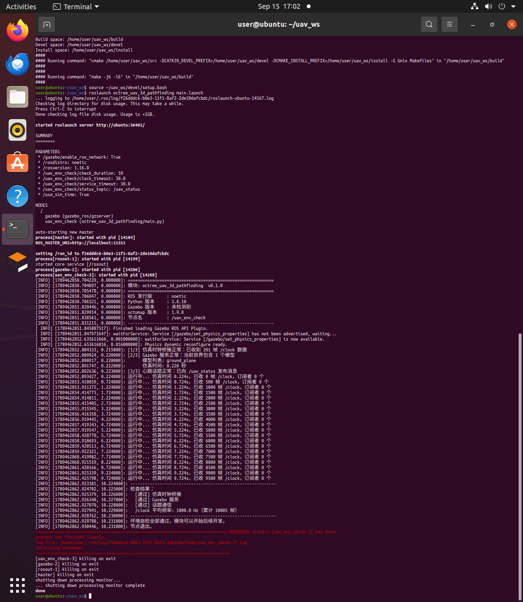
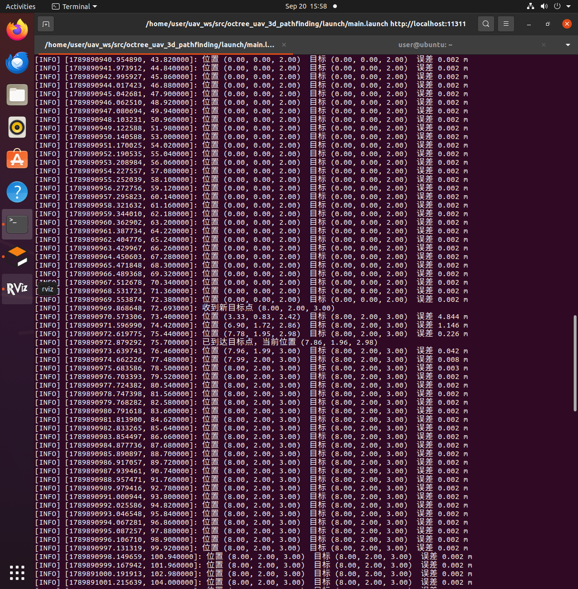
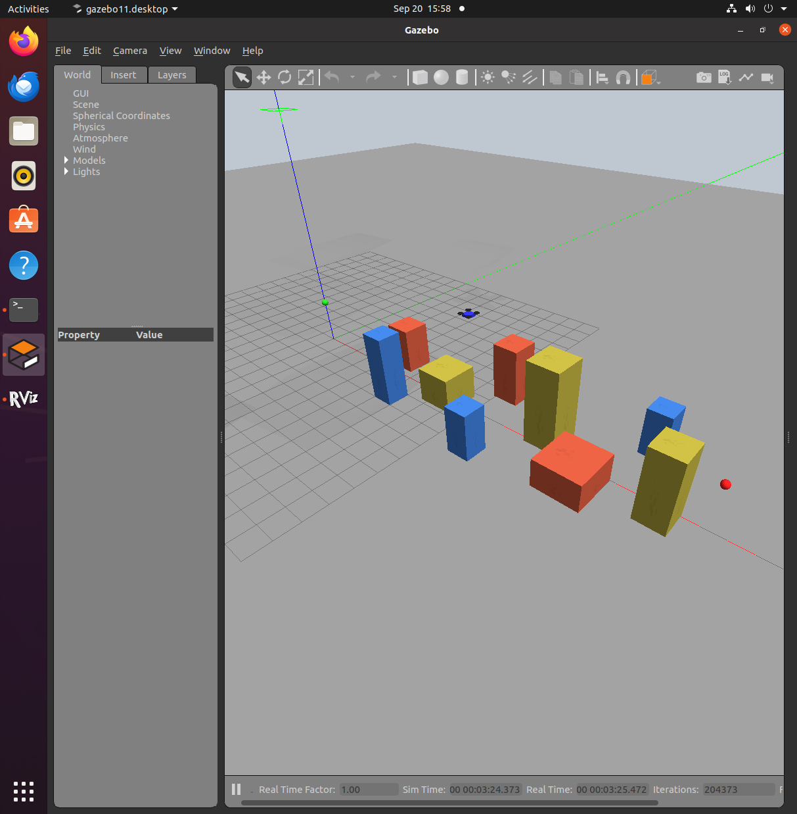

# octree_uav_3d_pathfinding

空域载具（无人机）的八叉树三维寻路模块。
从传感器点云构建八叉树占用地图，在八叉树上执行 A* 全局寻路，
并进行安全裕度处理与路径平滑，最终实现无人机的三维路径跟踪。

## 运行环境

| 类别 | 项目 | 版本 |
|---|---|---|
| 操作系统 | Ubuntu | 20.04.6 LTS |
| ROS | 发行版 | Noetic (ROS 1, 1.16.0) |
| 仿真器 | Gazebo | 11.13.0 |
| 三维地图 | octomap | 1.9.8 |
| 点云库 | PCL | 1.10 |
| 构建工具 | catkin | 0.8.10 |
| Python | 版本 | 3.8 |

## 编译

在终端中依次执行：

    mkdir -p ~/uav_ws/src
    cd ~/uav_ws/src && catkin_init_workspace
    # 将本模块放入 ~/uav_ws/src/
    cd ~/uav_ws && catkin_make
    source ~/uav_ws/devel/setup.bash

## 运行

一条命令启动仿真世界、四旋翼飞行器与位置控制器：

    roslaunch octree_uav_3d_pathfinding main.launch

可选的启动参数：

| 参数 | 默认值 | 说明 |
|---|---|---|
| gui | true | 是否启动 Gazebo 图形界面 |
| rviz | true | 是否启动 RViz |
| check | true | 是否运行环境自检节点 |
| control | true | 是否启动位置控制器 |
| world | models/obstacle_course.world | 障碍场景文件 |
| start_x / start_y / start_z | 0 / 0 / 2.0 | 起飞位置 |

例如无图形界面运行：

    roslaunch octree_uav_3d_pathfinding main.launch gui:=false rviz:=false

### 运行效果
模块启动后，环境自检节点会输出运行环境信息与三项链路检查结果：

模块启动后，位置控制器使飞行器稳定悬停在 2 m 高度，高度误差约 2 mm：

向 /uav/goal 下发目标点，飞行器受控飞向该点：

    rostopic pub -1 /uav/goal geometry_msgs/Point "{x: 8.0, y: 2.0, z: 3.0}"

到达目标点后稳定停住：

---

## 模块组成

### 环境自检节点 main.py

验证三条关键链路：

1. 仿真时钟桥接：订阅 /clock，确认 Gazebo 仿真时间已发布到 ROS
2. Gazebo 服务：调用 /gazebo/get_world_properties，确认仿真器在线
3. 话题通信：发布心跳话题 /uav_status

节点运行指定时长后自动退出，不影响仿真继续运行。

### 质点四旋翼 quadrotor.sdf

机体为 0.42 x 0.42 x 0.12 m、质量 1 kg 的立方体，作为"受控质点"：
开启重力，由外部控制器施加外力实现悬停与飞行。

搭载 3D 激光雷达（水平 360 度、垂直 8 线，量程 20 m），点云发布到
/cloud_in，作为八叉树占用地图的输入。

### 位置控制器 uav_controller.py

把飞行器视为受外力控制的质点，按 PD + 重力补偿计算控制量：

    F = m * ( Kp * (p_des - p) + Kd * (v_des - v) + g_vec )

订阅 /ground_truth/odom 获取位姿与速度，向 /quadrotor/wrench 施加外力，
使飞行器稳定悬停并可受控飞向目标点。

## 主要话题

| 话题 | 类型 | 方向 | 说明 |
|---|---|---|---|
| /cloud_in | sensor_msgs/PointCloud | 发布 | 3D 激光雷达点云 |
| /ground_truth/odom | nav_msgs/Odometry | 发布 | 飞行器位姿与速度 |
| /quadrotor/wrench | geometry_msgs/Wrench | 订阅 | 施加在机体上的外力 |
| /uav/goal | geometry_msgs/Point | 订阅 | 位置控制器目标点 |
| /uav/status | std_msgs/String | 发布 | 控制器运行状态 |
| /clock | rosgraph_msgs/Clock | 发布 | 仿真时钟（由 Gazebo 提供） |

## 参数配置

参数位于 config/params.yaml，由 main.launch 载入。

uav_env_check（环境自检节点）：

| 参数 | 默认值 | 说明 |
|---|---|---|
| check_duration | 5.0 | 自检运行时长（秒） |
| clock_timeout | 30.0 | 等待 /clock 的超时时间（秒） |
| service_timeout | 30.0 | 等待 Gazebo 服务的超时时间（秒） |

uav_controller（位置控制器）：

| 参数 | 默认值 | 说明 |
|---|---|---|
| mass | 1.0 | 机体质量（kg），需与 quadrotor.sdf 一致 |
| kp | 4.0 | 位置环比例增益 |
| kd | 4.0 | 速度环阻尼增益 |
| gravity | 9.81 | 重力加速度，用于重力补偿 |
| max_force | 40.0 | 外力限幅（N） |
| control_rate | 50.0 | 控制频率（Hz） |
| goal_x / goal_y / goal_z | 0 / 0 / 2.0 | 初始目标点 |

## 目录结构

    octree_uav_3d_pathfinding/
      package.xml                  包声明与依赖
      CMakeLists.txt               编译规则
      README.md                    本文件
      launch/main.launch           模块统一入口
      scripts/main.py              环境与链路自检节点
      scripts/uav_controller.py    质点四旋翼位置控制器
      config/params.yaml           参数配置
      models/quadrotor.sdf         质点四旋翼模型（含 3D 激光雷达）
      models/obstacle_course.world 障碍场景
      rviz/default.rviz            RViz 可视化预设
      docs/                        运行效果图

## 常见问题

| 现象 | 原因与处理 |
|---|---|
| Unable to communicate with master | ROS 主节点未启动，用 roslaunch 会自动启动 |
| RLException: not a launch file name | 未载入本工作空间，执行 source ~/uav_ws/devel/setup.bash |
| /clock 等待超时 | Gazebo 未启动，或直接运行 gzserver 未拉起 ROS 主节点 |
| catkin_make: command not found | 未载入 ROS 环境，执行 source /opt/ros/noetic/setup.bash |
| 飞行器持续下坠 | 位置控制器未启动，检查 control 参数与 /ground_truth/odom 是否有数据 |

## 后续计划

| 提交 | 内容 | 状态 |
|---|---|---|
| 1 | 模块骨架、launch 入口、环境自检 | 已完成 |
| 2 | 质点四旋翼模型、3D 激光雷达传感器 | 已完成 |
| 3 | 位置控制器（受控悬停与飞行） | 已完成 |
| 4 | 点云转八叉树占用地图 | 进行中 |
| 5 | 八叉树上的 A* 全局寻路 | 待开发 |
| 6 | 安全裕度与路径平滑 | 待开发 |
| 7 | 路径跟踪与闭环飞行 | 待开发 |

## 参考

- OctoMap 官网：https://octomap.github.io/
- Hornung et al., OctoMap: An Efficient Probabilistic 3D Mapping Framework Based on Octrees, Autonomous Robots, 2013